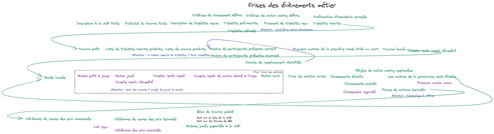
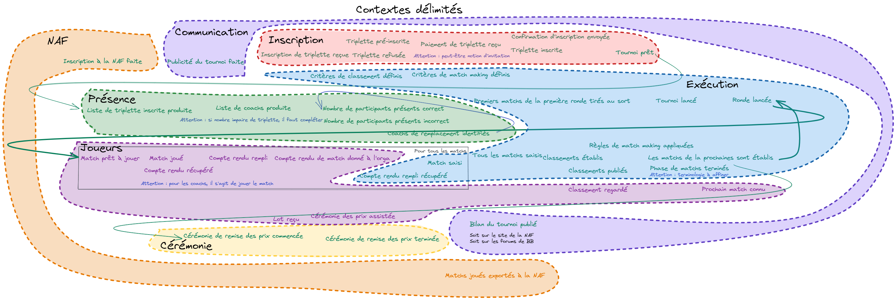

# Domain Driven Design study on Bloodbowl tournament

As I had been done in french, this page is for now in french :fr:.

## Glossaire

### Notions liées au Bloodbowl

- Bloodbowl : Jeu de plateau qui simule un sport mélange de football américain et de rugby dans un univers fantastique peuplé d'elfes, d'orques ;
- Coach : Personne physique qui joue à Bloodbowl ;
- Confrontation : Partie entre deux triplettes - 3 matchs ;
- Match : Partie entre deux coachs ;
- NAF : Association mondiale des coachs de Bloodbowl ;
- Squad : Groupe de coachs ;
- Tournoi : Evènement regroupant dans une unité de temps des coachs organisés en squad ou non, plusieurs matchs sont joués et donne lieu à un ou plusieurs classements ensuite ;
- Triplette : Squad de trois coachs.

### Notions liées au DDD

- Contexte : Choix de délimitation d'un domaine ;
- Domaine : Sous ensemble métier lié à un problématique ou une expertise ;
- Entité métier : Objets métier qui ont une identité (c'est à dire que l'on peut savoir s'il s'agit du même objet);
- Frise des évènements : Liste des évènements métier ordonnés ;
- Langage commun (ubiquitous language :gb:) : Langage utilisé par les experts du métier pour parler du métier, ici, langage utilisé par les experts des tournois de Bloodbowl pour parler des tournois de Bloodbowl ;
- Processus métier : Ensemble de modification qui permettent de passer d'un évènement de début de contexte à un évènement de fin de contexte ;

### Frise des évènements

Voici la liste des évènements ordonnés

### Domaines

Il a été identifié 7 domaines dont nous avons tirés des contextes :

- NAF ;
- Communication ;
- Inscription ;
- Présence ;
- Exécution ;
- Joueurs ;
- Cérémonie.

.

Dans le cadre de cette architecture, les contextes d'intérêt sont `présence`, `exécution` et `joueurs`.
